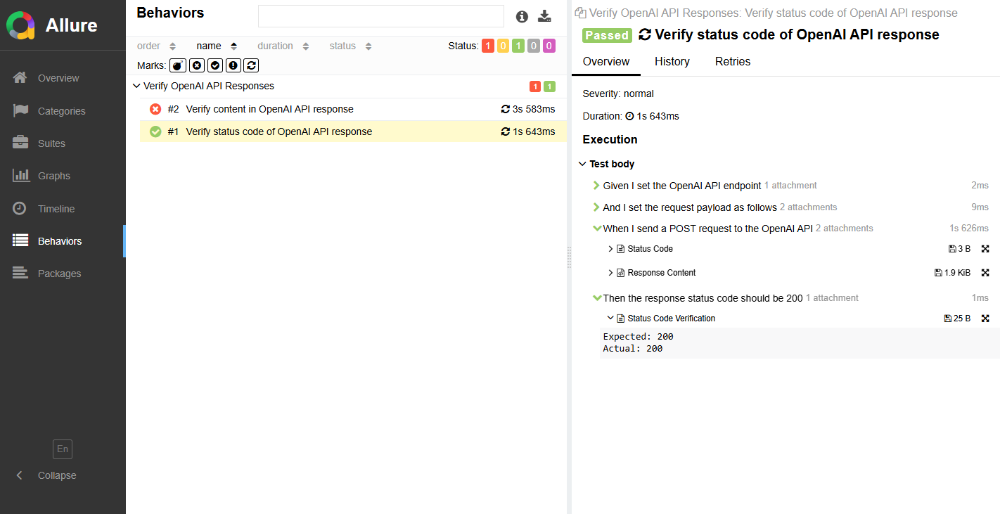

# API Automation Framework using Behave and Allure Reporting

This project is a Python-based API automation framework using **Behave** (a BDD testing framework) and **Allure** for reporting. The framework is designed to automate testing of an Azure OpenAI API, supporting dynamic payloads from feature files and generating comprehensive reports with Allure.

---

## 📁 **Project Structure**

```
├── .env                     # Environment variables file
├── features
│   ├── api_testing.feature   # Feature file containing test scenarios
│   └── steps
│       └── api_steps.py      # Step definitions for the feature file
├── payloads
│   └── request_payload.json  # JSON file for request payload (if needed)
├── allure-results            # Directory where Allure results are generated
├── requirements.txt          # Python dependencies
└── README.md                 # Project documentation
```

---

## 🚀 **Setup Instructions**

### ✅ **Step 1: Clone the Repository**

```bash
git clone <repository_url>
cd <repository_folder>
```

### ✅ **Step 2: Create a Virtual Environment**

```bash
python -m venv venv
source venv/bin/activate    # On Linux/Mac
venv\Scripts\activate      # On Windows
```

### ✅ **Step 3: Install Dependencies**

Install the required packages from `requirements.txt`:

```bash
pip install -r requirements.txt
```

### ✅ **Step 4: Set Up Environment Variables**

Create a `.env` file in the root directory with the following content:

```
API_URL=https://genai-poc-4dc1d.openai.azure.com/openai/deployments/gpt-4o-mini/chat/completions?api-version=2024-08-01-preview
API_KEY=your_api_key_here
```

Replace `your_api_key_here` with your actual API key.

### ✅ **Step 5: Run the Tests And Generate The Report**

Execute the tests using Behave with Allure reporting:

1. Run the tests with Allure reporting:

   ```bash
   behave -f allure_behave.formatter:AllureFormatter -o allure-results
   ```

2. Generate Allure HTML report:

   ```bash
   allure generate allure-results/ -o allure-html/ --clean
   ```
3. Open Allure HTML report:

   ```bash
   allure open allure-html
   ```   

### ✅ **Step 6: Allure Report**

---

## 📝 **Feature File: `api_testing.feature`**

The feature file contains BDD test scenarios for the API.

```gherkin
Feature: Verify OpenAI API Responses

  Scenario: Verify status code of OpenAI API response
    Given I set the OpenAI API endpoint
    And I set the request payload as follows
      """
      {
          "messages": [
              {
                  "role": "system",
                  "content": "you are a helpful assistant that answers professionally"
              },
              {
                  "role": "user",
                  "content": "list all the keywords in java"
              }
          ]
      }
      """
    When I send a POST request to the OpenAI API
    Then the response status code should be 200
```

---

## 📜 **Step Definitions: `api_steps.py`**

The step definitions contain the logic for each step in the feature file.

```python
import requests
from behave import given, when, then
import json
import os
from dotenv import load_dotenv
import allure

# Load environment variables from .env file
load_dotenv()

API_URL = os.getenv("API_URL")
API_KEY = os.getenv("API_KEY")

HEADERS = {
    "api-key": API_KEY,
    "Content-Type": "application/json"
}

@given('I set the OpenAI API endpoint')
@allure.step("Setting the OpenAI API endpoint")
def step_set_api_endpoint(context):
    context.api_url = API_URL
    context.headers = HEADERS

```

---

## 📦 **Dependencies**

The framework requires the following dependencies:

```text
behave
requests
dotenv
allure-behave
```

You can install them using:

```bash
pip install -r requirements.txt
```

---
